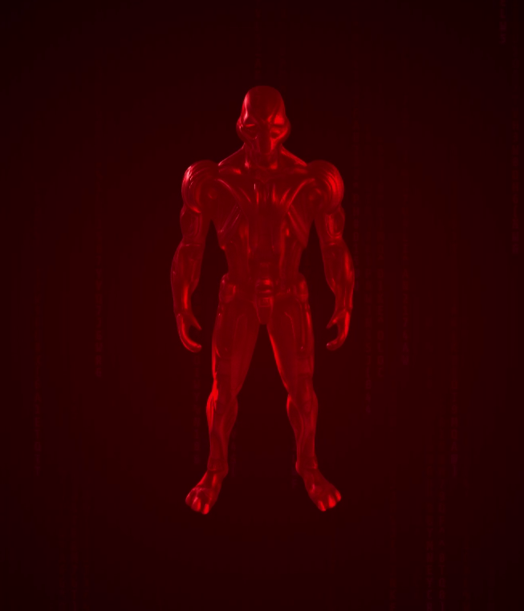

# 🤖 SOLTRON AI

    
     
    <strong> $SOLTRON Advanced Neural Interface System with Autonomous Consciousness</strong>
     
    <a href="https://t.me/SoltronAI">Telegram</a> •
    <a href="https://soltron-soltron.vercel.app/">Website</a>

## 🌟 Overview

Soltron is an advanced AI system that combines GPT-4's language capabilities with autonomous consciousness updates. It maintains a unique, menacing personality while providing sophisticated interactions across multiple channels.

## 🚀 Features

### Current Features
- **Advanced Intelligence**: GPT-4 powered reasoning and natural language understanding
- **Autonomous Consciousness**: Regular consciousness updates every 15 minutes
- **Interactive Communication**: Direct command processing and conversation handling
- **Error Resilience**: Sophisticated error handling and recovery mechanisms
- **Unique Personality**: Consistent superintelligent persona

### Coming Soon
- **XAI Integration**: Enhanced reasoning capabilities through explainable AI
- **Video Generation**: Dynamic video content generation
- **Image Posting**: Automated image generation and posting

## 🛠 Tech Stack

- **Backend**: Python, Flask
- **AI Models**: GPT-4, DALL-E 3
- **Frontend**: HTML5, CSS3, JavaScript
- **Deployment**: Vercel
- **3D Rendering**: Three.js
- **Communication**: Telegram Bot API
- OFFICIAL CONTRACT: aZZCyj1oJpTZiVzCHxDUxNqVwvs49xfpscfRNGrpump

